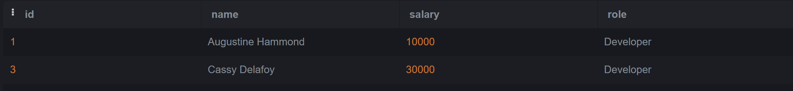
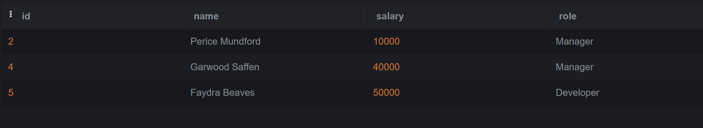
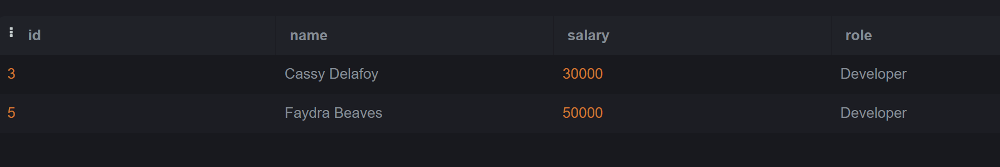
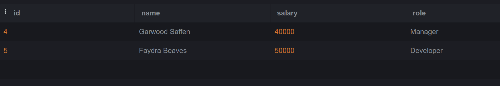

# SQL_Lab2

- Q1: Choose all employees who have received an award (Nested Query)?

Query:
 ```sql
SELECT *
FROM employee
WHERE id in (SELECT employee_id FROM awards);
```
  Output:
  
  
- Q2: Choose all employees who have never received an award (Nested Query)?

Query:
 ```sql
SELECT *
FROM employee
WHERE Not id in (SELECT employee_id FROM awards);
```
  Output:
  

- Q3: Choose all Developers who make more than all Managers combined (Nested Query)?

Query:
 ```sql
SELECT * 
FROM employee
WHERE role='Developer' and salary > (SELECT max(salary) FROM employee WHERE role='Manager');
```
  Output:
  

  - Q4: Choose all Developers who make more money than any Manager (Nested Query)?

Query:
 ```sql
SELECT *
FROM employee
WHERE role='Developer' and salary > (SELECT salary FROM employee WHERE role='Manager');
```
  Output:
  

   - Q5: Choose all employees whose salaries are higher than the average for their position. (Nested Query)?

Query:
 ```sql
SELECT *
FROM employee e
WHERE salary > (SELECT Avg(salary) FROM employee where role=e.role);
```
  Output:
  


  
